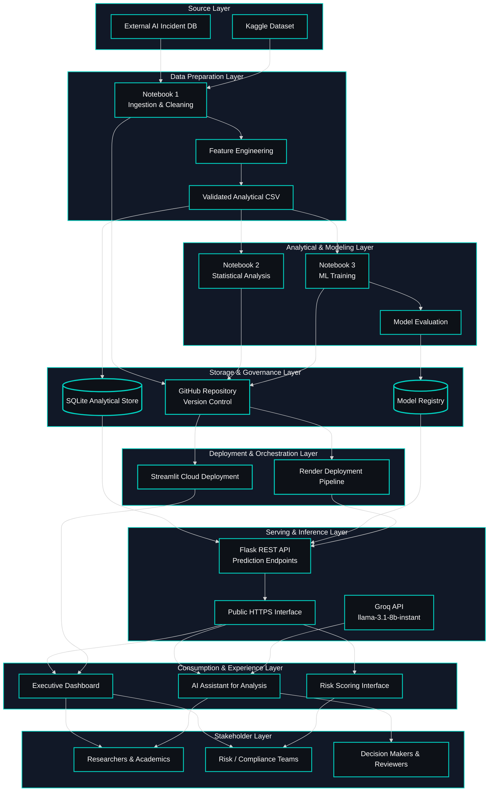

## MLOps Design - System Architecture 

  

```mermaid
%%{init: {'theme':'dark'}}%%
flowchart TB

subgraph L1["Source Layer"]
    A1["External AI Incident DB"]
    A2["Kaggle Dataset"]
end

subgraph L2["Data Preparation Layer"]
    B1["Notebook 1\nIngestion & Cleaning"]
    B2["Feature Engineering"]
    B3["Validated Analytical CSV"]
end

subgraph L3["Analytical & Modeling Layer"]
    C1["Notebook 2\nStatistical Analysis"]
    C2["Notebook 3\nML Training"]
    C3["Model Evaluation"]
end

subgraph L4["Storage & Governance Layer"]
    D1[("SQLite Analytical Store")]
    D2[("Model Registry")]
    D3["GitHub Repository\nVersion Control"]
end

subgraph L5["Deployment & Orchestration Layer"]
    E1["Render Deployment Pipeline"]
    E2["Streamlit Cloud Deployment"]
end

subgraph L6["Serving & Inference Layer"]
    F1["Flask REST API\nPrediction Endpoints"]
    F2["Public HTTPS Interface"]
    F3["Groq API\nllama-3.1-8b-instant"]
end

subgraph L7["Consumption & Experience Layer"]
    G1["Executive Dashboard"]
    G2["Risk Scoring Interface"]
    G3["AI Assistant for Analysis"]
end

subgraph L8["Stakeholder Layer"]
    H1["Researchers & Academics"]
    H2["Risk / Compliance Teams"]
    H3["Decision Makers & Reviewers"]
end

A1 --> B1
A2 --> B1
B1 --> B2
B2 --> B3
B3 --> C1
B3 --> C2
B3 --> D1
C2 --> C3
C3 --> D2
B1 --> D3
C1 --> D3
C2 --> D3
D1 --> F1
D2 --> F1
D3 --> E1
D3 --> E2
E1 --> F1
F1 --> F2
F2 --> G1
F2 --> G2
F2 --> G3
F3 --> G3
E2 --> G1
G1 --> H1
G1 --> H2
G2 --> H2
G3 --> H1
G3 --> H3

%% STYLE
classDef node fill:#0d1117,stroke:#00d1c1,stroke-width:1.9px,color:#ffffff;
classDef db fill:#0d1117,stroke:#00d1c1,stroke-width:2.6px,color:#ffffff;
classDef cloud fill:#0d1117,stroke:#00d1c1,stroke-width:2.1px,color:#ffffff;
classDef layer fill:#111827,stroke:#00d1c1,stroke-width:1.6px,color:#ffffff;

class A1,A2,B1,B2,B3,C1,C2,C3,F1,F2,F3,G1,G2,G3,H1,H2,H3 node;
class D1,D2 db;
class D3,E1,E2 cloud;
class L1,L2,L3,L4,L5,L6,L7,L8 layer;
```

