<!-- ======================================= ⚡️ Start DEFAULT HEADER ===========================================  -->

<!-- ========= START LANGUAGE BUTTON ========= -->
 

**\[[🇧🇷 Português](README.pt_BR.md)\] \[**[🇬🇧 English](README.md)**\]**

  
<!-- ========= END LANGUAGE BUTTON ========= -->

<!-- ========= START REPO TITLE ========= -->
# 
 🔐 [AI Incidents in Banking, Financial Services and Fintech]()

###  
 An Analysis of Algorithmic Bias, Operational Risk and Governance for Regulatory Compliance

  

<!-- ========= END REPO TITLE ========= -->

<!-- ========= START DashBoar Streamlit -->

  

<!-- ========= END Dashboard Streamlit -->

  

  

<!-- ========= END PPTX -->

<!-- ========= START DATA ANALYSING REPORT ========= -->

  

<!-- ========= END DATA ANALYSING REPORT ========= -->

    
<!-- ========= END BADGE ========= -->

<!-- ========= START Institucional INFO ========= -->

<!-- ========= START Institucional INFO ========= -->

 

[**Institution:**]() Pontifical Catholic University of São Paulo (PUC‑SP – Humanistic AI & Data Science • 5º Semester • 2026)  
[**School:**]() FACEI – Faculty of Interdisciplinary Studies  
[**Course:**]() AI Security, Cybersecurity & Social Engineering  
**Professor:** [✨ Eduardo Savino Gomes]()  
**Authors:**[Fabiana ⚡️ Campanari](https://linktr.ee/fabianacampanari) e [Perdro Vyctor Almeida]()   
[**Context:**]() This project analyzes real-world AI incidents in banking, financial services and fintech through the lenses of AI security, cybersecurity, social engineering, governance and regulatory compliance.

  
<!-- ========= END Institucional INFO ========= -->

<!-- ========= START SPONSOR BADGES ========= -->

#### 
 

  
<!-- ========= END SPONSOR BADGES ========= -->

<!-- ========= START DEMO VIDEO ========= -->

https://github.com/user-attachments/assets/5d3c33b0-166e-414c-a561-8e8dd509be3d

#### 🖤 Creative Direction, Music Curation & Editing  by Fab⚡️  
##### 🎶 Soundtrack: "Canon in D" — Johann Pachelbel

   
<!-- ========= END DEMO VIDEO ========= -->

<!-- ========= START BADGES ========= -->

  
  
  
  
  
  
  
  
  
  
  

   
<!-- ========= END  BADGES ========= -->

<!-- ========= START INTRO ========= -->
## [Overview]()

This project consolidates an end-to-end perspective on AI incidents in financial services, connecting public data from the AI Incident Database (AIID) to a complete pipeline of analysis, modeling, and exposure through API and dashboard.

From an executive perspective, the work demonstrates how dispersed incidents can be transformed into structured risk indicators, with a focus on [**algorithmic bias**](), [**operational risk**](), and [**governance responses**](). The main contribution lies in the **integrated analytical architecture**: from data acquisition to the availability of RESTful endpoints and a visualization layer.

The system answers questions such as:

[-]() Which types of AI applications generate the most incidents in the financial sector?  
[-]() Does algorithmic bias affect customer segments unequally?  
[-]() Is it possible to predict the severity of an incident before a regulatory investigation?

  

> [!IMPORTANT]
>
> [**Correct positioning**:]() predictive models should be treated as a **methodological proof of concept**. The main deliverable is the integrated analytical architecture — not a high-accuracy classifier ready for production.  

  

#

  
<!-- ========= END INTRO ========= -->

<!-- ========= START Confidentiality statement ========= -->

> [!NOTE]
> 
> ⚠️ Heads Up
>
> * Projects and deliverables may be made [publicly available]() whenever possible.
>   
> * The course emphasizes [**practical, hands-on experience**]() with real datasets to simulate professional consulting scenarios in the fields of **Machine Learning and Neural Networks** for partner organizations and institutions affiliated with the university.
>   
> * All activities comply with the [**academic and ethical guidelines of PUC-SP**]().
>   
> * Any content not authorized for public disclosure will remain [**confidential**]() and securely stored in [private repositories]().  
>  
>
>

   

#

  
<!-- ========= END Confidentiality statement  ========= -->

<!-- ========= START Main Repo REFERENCE  ========= -->
> [!TIP]
>
> This repository is part of the flagship project:
> **🔐 Cybersecurity, Social Engineering & AI Security — Main Hub**
>
> Explore the complete ecosystem of materials, analyses, and notebooks in the central repository:
>
> * 🔗 **[Cybersecurity, Social Engineering & AI Security — Main Hub Repository](https://github.com/Quantum-Software-Development/1-Cybersecurity-SocialEngineering_Main_Hub_Repository-PUCSP)**
>
> *Part of the Humanistic AI Data Modeling Series — where data connects with human insight… and occasionally gets socially engineered. ⚡️

    
<!-- ========= END Main Repo REFERENCE  ========= -->

<!-- ======================================= END DEFAULT HEADER ⚡️ ===========================================  -->

## Table of Contents

1. [Introduction](#1-introduction)
2. [Objectives and Research Questions](#2-objectives-and-research-questions)
3. [Data Background and Context](#3-data-background-and-context)
4. [CRISP-DM Methodology](#4-crisp-dm-methodology)
5. [Data Sources and Preparation](#5-data-sources-and-preparation)
6. [Analytical Variables and Hypotheses](#6-analytical-variables-and-hypotheses)
7. [Statistical Analysis and Inferential Results](#7-statistical-analysis-and-inferential-results)
8. [Machine Learning Modeling](#8-machine-learning-modeling)
9. [Relational Database and RESTful API](#9-relational-database-and-restful-api)
10. [Interactive Dashboard](#10-interactive-dashboard)
11. [System Architecture](#11-system-architecture)
12. [Technical Notebook Structure](#12-technical-notebook-structure)
13. [Consolidated Results](#13-consolidated-results)
14. [Limitations and Methodological Considerations](#14-limitations-and-methodological-considerations)
15. [Technology Stack](#15-technology-stack)
16. [Local Execution Guide](#16-local-execution-guide)
17. [Groq API Configuration](#17-groq-api-configuration)
18. [Production Deployment](#18-production-deployment)
19. [API Infrastructure and Publishing on Render](#19-api-infrastructure-and-publishing-on-render)
20. [File Structure](#20-file-structure)
21. [Dependencies](#21-dependencies)
22. [Conclusions and Next Steps](#22-conclusions-and-next-steps)
23. [References](#23-references)

  

## 1. [Introduction]()

 

### 1.1 [**Context of the topic**]()

The use of Artificial Intelligence systems in the financial sector has been growing rapidly in applications such as [**credit scoring**](), [**fraud detection**](), [**algorithmic trading**](), *[**risk assessment**](), customer service automation, and compliance support. This advancement expands institutions’ operational capacity but also introduces new risk vectors, especially in highly regulated environments sensitive to automated decision-making failures.

In the financial sector, AI failures do not only affect technical performance. They can generate reputational damage, discriminatory bias, operational losses, regulatory scrutiny, and changes in internal policies. Therefore, analyzing real AI incidents in this domain is a concrete way to bridge algorithmic governance, risk management, and empirical evidence.

This project was built using real documented incidents from the [**AI Incident Database (AIID)**](https://incidentdatabase.ai/) filtered for the financial services context. The central proposal is to transform this dataset into a structured analytical base capable of supporting statistical analysis, predictive modeling, relational storage, API exposure, and dashboard consumption.

 

### 1.2 [**Research problem**]()

Given a set of AI incidents recorded across multiple sectors and filtered to the financial domain, the central problem is to evaluate whether:

 

[-]() there are **systematic patterns** of bias and risk associated with certain types of AI applications (credit, fraud, *trading*);
[-]() certain **customer segments** are disproportionately affected;
[-]() **governance and regulatory responses** adequately match the severity of incidents.

 

### 1.3 [**Relevance to the financial sector and AI governance**]()

 

| [Stakeholder]()            | [Direct Benefit]()                                           |
| -------------------------- | ------------------------------------------------------------ |
| [**Banks and Fintechs**]() | Improve operational and reputational risk management         |
| [**Regulators**]()         | Evidence-based and data-driven supervision                   |
| [**Risk Managers**]()      | Tools to assess exposure to AI incidents                     |
| [**Compliance**]()         | Identify regulatory gaps and prioritize audits               |
| [**Investors**]()          | Understand the impact of AI incidents on institutional value |

  

> [!TIP]
>
> For [**AI governance**](), the project illustrates how incident data can be transformed into indicators, predictive models, and APIs, enabling continuous monitoring and structured responses to risks.
>
>  

  

## 2. [Objectives and Questions]()

 

### 2.1 [General Objective]()

To evaluate, based on structured data from AI incidents in the financial sector, whether there are relevant patterns of **algorithmic bias**, **operational risk**, and **governance**, producing evidence useful for analysis, monitoring, and decision support.

  

### 2.2 [Specific objectives]()

 

[1.]() Identify AI incidents related to financial services.  
[2.]() Structure and enrich the data with derived analytical variables.  
[3.]() Evaluate statistical hypotheses on concentration, bias, severity, and regulatory response.    
[4.]() Build predictive models for severity classification and regulatory investigation.  
[5.]() Organize results into an architecture composed of notebooks, relational database, RESTful API, and dashboard.

  

### 2.3 [Research hypotheses]()

 

| [Hypothesis]() | [Question]()                                                   | [Approach]()                        |
| -------------- | -------------------------------------------------------------- | ----------------------------------- |
| [H1]()         | Are incidents concentrated in certain application types?       | Chi-square goodness-of-fit          |
| [H2]()         | Does algorithmic bias disproportionately affect segments?      | Chi-square test of independence     |
| [H3]()         | Do more severe incidents generate greater regulatory response? | Chi-square and logistic regression  |
| [H4]()         | Is there a temporal trend in incident volume?                  | Time correlation and trend analysis |

  
  
  

## System Architecture (MLOps Design)

```mermaid
%%{init: {'theme':'dark'}}%%
flowchart LR

subgraph L1["Source Layer"]
    A1["External AI Incident DB"]
    A2["Kaggle Dataset"]
end

subgraph L2["Data Preparation Layer"]
    B1["Notebook 1\nIngestion & Cleaning"]
    B2["Feature Engineering"]
    B3["Validated Analytical CSV"]
end

subgraph L3["Analytical & Modeling Layer"]
    C1["Notebook 2\nStatistical Analysis"]
    C2["Notebook 3\nML Training"]
    C3["Model Evaluation"]
end

subgraph L4["Storage & Governance Layer"]
    D1[("SQLite Analytical Store")]
    D2[("Model Registry")]
    D3["GitHub Repository\nVersion Control"]
end

subgraph L5["Deployment & Orchestration Layer"]
    E1["Render Deployment Pipeline"]
    E2["Streamlit Cloud Deployment"]
end

subgraph L6["Serving & Inference Layer"]
    F1["Flask REST API\nPrediction Endpoints"]
    F2["Public HTTPS Interface"]
    F3["Groq API\nllama-3.1-8b-instant"]
end

subgraph L7["Consumption & Experience Layer"]
    G1["Executive Dashboard"]
    G2["Risk Scoring Interface"]
    G3["AI Assistant for Analysis"]
end

subgraph L8["Stakeholder Layer"]
    H1["Researchers & Academics"]
    H2["Risk / Compliance Teams"]
    H3["Decision Makers & Reviewers"]
end

A1 --> B1
A2 --> B1
B1 --> B2
B2 --> B3
B3 --> C1
B3 --> C2
B3 --> D1
C2 --> C3
C3 --> D2
B1 --> D3
C1 --> D3
C2 --> D3
D1 --> F1
D2 --> F1
D3 --> E1
D3 --> E2
E1 --> F1
F1 --> F2
F2 --> G1
F2 --> G2
F2 --> G3
F3 --> G3
E2 --> G1
G1 --> H1
G1 --> H2
G2 --> H2
G3 --> H1
G3 --> H3

%% STYLE
classDef node fill:#0d1117,stroke:#00d1c1,stroke-width:1.6px,color:#ffffff;
classDef db fill:#0d1117,stroke:#00d1c1,stroke-width:2.4px,color:#ffffff;
classDef cloud fill:#0d1117,stroke:#00d1c1,stroke-width:1.9px,color:#ffffff;
classDef layer fill:#111827,stroke:#00d1c1,stroke-width:1.4px,color:#ffffff;

class A1,A2,B1,B2,B3,C1,C2,C3,F1,F2,F3,G1,G2,G3,H1,H2,H3 node;
class D1,D2 db;
class D3,E1,E2 cloud;
class L1,L2,L3,L4,L5,L6,L7,L8 layer;
```

 

 

>  [Click here to view the diagram in higher resolution.](https://github.com/Quantum-Software-Development/4-cybersecurity-social-engineering-project-ai-risk-intelligence-financial-incidents-analytics/blob/99fe399886300a088411de18650726f4441bb71c/MLOps-Architecture%20.md)

  

  
  
  
  
  
  

<!-- ======================================= Start DEFAULT Footer ===========================================  -->
  

## 💌 [Let the data flow... Ping Me !](mailto:fabicampanari@proton.me)

 

#### 
  🛸๋ My Contacts [Hub](https://linktr.ee/fabianacampanari)

 

### 
 

  

  ────────────── ⊹🔭๋ ──────────────

<!--

  ────────────── 🛸๋*ੈ✩* 🔭*ੈ₊ ──────────────
-->

 

 ➣➢➤ <a href="#top">Back to Top </a>
  

  
#
 
##### 
 Copyright 2026 Quantum Software Development. Code released under the  [MIT license.](https://github.com/Mindful-AI-Assistants/CDIA-Entrepreneurship-Soft-Skills-PUC-SP/blob/21961c2693169d461c6e05900e3d25e28a292297/LICENSE)

